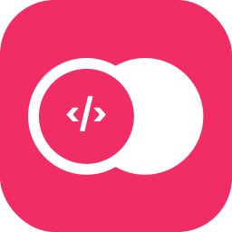
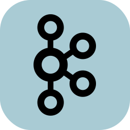

    <h1>IconsNew</h1>

Test icon with <a href="https://icons-theta.vercel.app/icons?i=es,lg,kb,&perline=1">https://icons-theta.vercel.app/icons?i=es,lg,kb,&perline=1</a>  

<table> <tr> <th>Name</th><th>Icon</th> <th>Name</th><th>Icon</th> <th>Name</th><th>Icon</th>  </tr>
    <tr>
        <td> <code>ableton</code> </td>
        <td>  </td>
        <td> <code>activitypub</code> </td>
        <td>  </td>
        <td> <code>actix</code> </td>
        <td>  </td>
    </tr>
    <tr>
        <td> <code>adonis</code> </td>
        <td>  </td>
        <td> <code>ae</code> </td>
        <td>  </td>
        <td> <code>aiscript</code> </td>
        <td>  </td>
    </tr>
    <tr>
        <td> <code>alpinejs</code> </td>
        <td>  </td>
        <td> <code>androidstudio</code> </td>
        <td>  </td>
        <td> <code>angular</code> </td>
        <td>  </td>
    </tr>
    <tr>
        <td> <code>ansible</code> </td>
        <td>  </td>
        <td> <code>apollo</code> </td>
        <td>  </td>
        <td> <code>appwrite</code> </td>
        <td>  </td>
    </tr>
    <tr>
        <td> <code>arduino</code> </td>
        <td>  </td>
        <td> <code>astro</code> </td>
        <td>  </td>
        <td> <code>atom</code> </td>
        <td>  </td>
    </tr>
    <tr>
        <td> <code>au</code> </td>
        <td>  </td>
        <td> <code>autocad</code> </td>
        <td>  </td>
        <td> <code>aws</code> </td>
        <td>  </td>
    </tr>
    <tr>
        <td> <code>azul</code> </td>
        <td>  </td>
        <td> <code>azure</code> </td>
        <td>  </td>
        <td> <code>babel</code> </td>
        <td>  </td>
    </tr>
    <tr>
        <td> <code>bash</code> </td>
        <td>  </td>
        <td> <code>bevy</code> </td>
        <td>  </td>
        <td> <code>blender</code> </td>
        <td>  </td>
    </tr>
    <tr>
        <td> <code>bootstrap</code> </td>
        <td>  </td>
        <td> <code>bsd</code> </td>
        <td>  </td>
        <td> <code>c</code> </td>
        <td>  </td>
    </tr>
    <tr>
        <td> <code>cs</code> </td>
        <td>  </td>
        <td> <code>cpp</code> </td>
        <td>  </td>
        <td> <code>crystal</code> </td>
        <td>  </td>
    </tr>
    <tr>
        <td> <code>cassandra</code> </td>
        <td>  </td>
        <td> <code>clojure</code> </td>
        <td>  </td>
        <td> <code>cloudflare</code> </td>
        <td>  </td>
    </tr>
    <tr>
        <td> <code>cmake</code> </td>
        <td>  </td>
        <td> <code>codepen</code> </td>
        <td>  </td>
        <td> <code>coffeescript</code> </td>
        <td>  </td>
    </tr>
    <tr>
        <td> <code>css</code> </td>
        <td>  </td>
        <td> <code>d3</code> </td>
        <td>  </td>
        <td> <code>dart</code> </td>
        <td>  </td>
    </tr>
    <tr>
        <td> <code>deno</code> </td>
        <td>  </td>
        <td> <code>devto</code> </td>
        <td>  </td>
        <td> <code>discord</code> </td>
        <td>  </td>
    </tr>
    <tr>
        <td> <code>bots</code> </td>
        <td>  </td>
        <td> <code>django</code> </td>
        <td>  </td>
        <td> <code>docker</code> </td>
        <td>  </td>
    </tr>
    <tr>
        <td> <code>dotnet</code> </td>
        <td>  </td>
        <td> <code>dynamodb</code> </td>
        <td>  </td>
        <td> <code>eclipse</code> </td>
        <td>  </td>
    </tr>
    <tr>
        <td> <code>elasticsearch</code> </td>
        <td> </td>
        <td> <code>electron</code> </td>
        <td>  </td>
        <td> <code>elixir</code> </td>
        <td>  </td>
    </tr>
    <tr>
        <td> <code>emacs</code> </td>
        <td>  </td>
        <td> <code>ember</code> </td>
        <td>  </td>
        <td> <code>emotion</code> </td>
        <td>  </td>
    </tr>
    <tr>
        <td> <code>express</code> </td>
        <td>  </td>
        <td> <code>fastapi</code> </td>
        <td>  </td>
        <td> <code>fediverse</code> </td>
        <td>  </td>
    </tr>
    <tr>
        <td> <code>figma</code> </td>
        <td>  </td>
        <td> <code>firebase</code> </td>
        <td>  </td>
        <td> <code>flask</code> </td>
        <td>  </td>
    </tr>
    <tr>
        <td> <code>flutter</code> </td>
        <td>  </td>
        <td> <code>forth</code> </td>
        <td>  </td>
        <td> <code>fortran</code> </td>
        <td>  </td>
    </tr>
    <tr>
        <td> <code>gamemakerstudio</code> </td>
        <td>  </td>
        <td> <code>gatsby</code> </td>
        <td>  </td>
        <td> <code>gcp</code> </td>
        <td>  </td>
    </tr>
    <tr>
        <td> <code>git</code> </td>
        <td>  </td>
        <td> <code>github</code> </td>
        <td>  </td>
        <td> <code>githubactions</code> </td>
        <td>  </td>
    </tr>
    <tr>
        <td> <code>gitlab</code> </td>
        <td>  </td>
        <td> <code>gherkin</code> </td>
        <td>  </td>
        <td> <code>go</code> </td>
        <td>  </td>
    </tr>
    <tr>
        <td> <code>gradle</code> </td>
        <td>  </td>
        <td> <code>godot</code> </td>
        <td>  </td>
        <td> <code>grafana</code> </td>
        <td>  </td>
    </tr>
    <tr>
        <td> <code>graphql</code> </td>
        <td>  </td>
        <td> <code>gtk</code> </td>
        <td>  </td>
        <td> <code>gulp</code> </td>
        <td>  </td>
    </tr>
    <tr>
        <td> <code>haskell</code> </td>
        <td>  </td>
        <td> <code>haxe</code> </td>
        <td>  </td>
        <td> <code>haxeflixel</code> </td>
        <td>  </td>
    </tr>
    <tr>
        <td> <code>heroku</code> </td>
        <td>  </td>
        <td> <code>hibernate</code> </td>
        <td>  </td>
        <td> <code>html</code> </td>
        <td>  </td>
    </tr>
    <tr>
        <td> <code>idea</code> </td>
        <td>  </td>
        <td> <code>ai</code> </td>
        <td>  </td>
        <td> <code>instagram</code> </td>
        <td>  </td>
    </tr>
    <tr>
        <td> <code>ipfs</code> </td>
        <td>  </td>
        <td> <code>java</code> </td>
        <td>  </td>
        <td> <code>js</code> </td>
        <td>  </td>
    </tr>
    <tr>
        <td> <code>jenkins</code> </td>
        <td>  </td>
        <td> <code>jest</code> </td>
        <td>  </td>
        <td> <code>jquery</code> </td>
        <td>  </td>
    </tr>
    <tr>
        <td> <code>kafka</code> </td>
        <td>  </td>
        <td> <code>kibana</code> </td>
        <td>  </td>
        <td> <code>kotlin</code> </td>
        <td>  </td>
    </tr>
    <tr>
        <td> <code>ktor</code> </td>
        <td>  </td>
        <td> <code>kubernetes</code> </td>
        <td>  </td>
        <td> <code>laravel</code> </td>
        <td>  </td>
    </tr>
    <tr>
        <td> <code>latex</code> </td>
        <td>  </td>
        <td> <code>linkedin</code> </td>
        <td>  </td>
        <td> <code>linux</code> </td>
        <td>  </td>
    </tr>
    <tr>
        <td> <code>lit</code> </td>
        <td>  </td>
        <td> <code>logstash</code> </td>
        <td>  </td>
        <td> <code>lua</code> </td>
        <td>  </td>
    </tr>
    <tr>
        <td> <code>md</code> </td>
        <td>  </td>
        <td> <code>mastodon</code> </td>
        <td>  </td>
        <td> <code>materialui</code> </td>
        <td>  </td>
    </tr>
    <tr>
        <td> <code>matlab</code> </td>
        <td>  </td>
        <td> <code>maven</code> </td>
        <td>  </td>
        <td> <code>misskey</code> </td>
        <td>  </td>
    </tr>
    <tr>
        <td> <code>mongodb</code> </td>
        <td>  </td>
        <td> <code>msdos</code> </td>
        <td>  </td>
        <td> <code>mysql</code> </td>
        <td>  </td>
    </tr>
    <tr>
        <td> <code>neovim</code> </td>
        <td>  </td>
        <td> <code>nestjs</code> </td>
        <td>  </td>
        <td> <code>netlify</code> </td>
        <td>  </td>
    </tr>
    <tr>
        <td> <code>nextjs</code> </td>
        <td>  </td>
        <td> <code>nginx</code> </td>
        <td>  </td>
        <td> <code>nim</code> </td>
        <td>  </td>
    </tr>
    <tr>
        <td> <code>nodejs</code> </td>
        <td>  </td>
        <td> <code>nuxtjs</code> </td>
        <td>  </td>
        <td> <code>ocaml</code> </td>
        <td>  </td>
    </tr>
    <tr>
        <td> <code>octave</code> </td>
        <td>  </td>
        <td> <code>openshift</code> </td>
        <td>  </td>
        <td> <code>openstack</code> </td>
        <td>  </td>
    </tr>
    <tr>
        <td> <code>perl</code> </td>
        <td>  </td>
        <td> <code>ps</code> </td>
        <td>  </td>
        <td> <code>php</code> </td>
        <td>  </td>
    </tr>
    <tr>
        <td> <code>plan9</code> </td>
        <td>  </td>
        <td> <code>planetscale</code> </td>
        <td>  </td>
        <td> <code>postgres</code> </td>
        <td>  </td>
    </tr>
    <tr>
        <td> <code>postman</code> </td>
        <td>  </td>
        <td> <code>powershell</code> </td>
        <td>  </td>
        <td> <code>pr</code> </td>
        <td>  </td>
    </tr>
    <tr>
        <td> <code>prisma</code> </td>
        <td>  </td>
        <td> <code>processing</code> </td>
        <td>  </td>
        <td> <code>prometheus</code> </td>
        <td>  </td>
    </tr>
    <tr>
        <td> <code>pug</code> </td>
        <td>  </td>
        <td> <code>py</code> </td>
        <td>  </td>
        <td> <code>pytorch</code> </td>
        <td>  </td>
    </tr>
    <tr>
        <td> <code>qt</code> </td>
        <td>  </td>
        <td> <code>r</code> </td>
        <td>  </td>
        <td> <code>rabbitmq</code> </td>
        <td>  </td>
    </tr>
    <tr>
        <td> <code>rails</code> </td>
        <td>  </td>
        <td> <code>raspberrypi</code> </td>
        <td>  </td>
        <td> <code>react</code> </td>
        <td>  </td>
    </tr>
    <tr>
        <td> <code>reactivex</code> </td>
        <td>  </td>
        <td> <code>redis</code> </td>
        <td>  </td>
        <td> <code>redux</code> </td>
        <td>  </td>
    </tr>
    <tr>
        <td> <code>regex</code> </td>
        <td>  </td>
        <td> <code>remix</code> </td>
        <td>  </td>
        <td> <code>replit</code> </td>
        <td>  </td>
    </tr>
    <tr>
        <td> <code>rocket</code> </td>
        <td>  </td>
        <td> <code>rollupjs</code> </td>
        <td>  </td>
        <td> <code>ros</code> </td>
        <td>  </td>
    </tr>
    <tr>
        <td> <code>ruby</code> </td>
        <td>  </td>
        <td> <code>rust</code> </td>
        <td>  </td>
        <td> <code>sass</code> </td>
        <td>  </td>
    </tr>
    <tr>
        <td> <code>spring</code> </td>
        <td>  </td>
        <td> <code>sqlite</code> </td>
        <td>  </td>
        <td> <code>stackoverflow</code> </td>
        <td>  </td>
    </tr>
    <tr>
        <td> <code>styledcomponents</code> </td>
        <td>  </td>
        <td> <code>supabase</code> </td>
        <td>  </td>
        <td> <code>scala</code> </td>
        <td>  </td>
    </tr>
    <tr>
        <td> <code>selenium</code> </td>
        <td>  </td>
        <td> <code>sentry</code> </td>
        <td>  </td>
        <td> <code>sequelize</code> </td>
        <td>  </td>
    </tr>
    <tr>
        <td> <code>sketchup</code> </td>
        <td>  </td>
        <td> <code>solidity</code> </td>
        <td>  </td>
        <td> <code>solidjs</code> </td>
        <td>  </td>
    </tr>
    <tr>
        <td> <code>svelte</code> </td>
        <td>  </td>
        <td> <code>svg</code> </td>
        <td>  </td>
        <td> <code>swift</code> </td>
        <td>  </td>
    </tr>
    <tr>
        <td> <code>symfony</code> </td>
        <td>  </td>
        <td> <code>tailwind</code> </td>
        <td>  </td>
        <td> <code>tauri</code> </td>
        <td>  </td>
    </tr>
    <tr>
        <td> <code>tensorflow</code> </td>
        <td>  </td>
        <td> <code>threejs</code> </td>
        <td>  </td>
        <td> <code>twitter</code> </td>
        <td>  </td>
    </tr>
    <tr>
        <td> <code>ts</code> </td>
        <td>  </td>
        <td> <code>unity</code> </td>
        <td>  </td>
        <td> <code>unreal</code> </td>
        <td>  </td>
    </tr>
    <tr>
        <td> <code>v</code> </td>
        <td>  </td>
        <td> <code>vala</code> </td>
        <td>  </td>
        <td> <code>vercel</code> </td>
        <td>  </td>
    </tr>
    <tr>
        <td> <code>vim</code> </td>
        <td>  </td>
        <td> <code>visualstudio</code> </td>
        <td>  </td>
        <td> <code>vite</code> </td>
        <td>  </td>
    </tr>
    <tr>
        <td> <code>vscode</code> </td>
        <td>  </td>
        <td> <code>vue</code> </td>
        <td>  </td>
        <td> <code>wasm</code> </td>
        <td>  </td>
    </tr>
    <tr>
        <td> <code>webflow</code> </td>
        <td>  </td>
        <td> <code>webpack</code> </td>
        <td>  </td>
        <td> <code>windicss</code> </td>
        <td>  </td>
    </tr>
    <tr>
        <td> <code>wordpress</code> </td>
        <td>  </td>
        <td> <code>workers</code> </td>
        <td>  </td>
        <td> <code>xd</code> </td>
        <td>  </td>
    </tr>
    <tr>
        <td> <code>zig</code> </td> 
        <td>  </td>
    </tr>
</table>
