

    <h1>IconsNew</h1>

Test icon with <a href="https://icons-theta.vercel.app/icons?i=es,lg,kb,&perline=1">https://icons-theta.vercel.app/icons?i=es,lg,kb,&perline=1</a>  

## Adding icons
You can add any icons from [Icons list](#icons-list) --> 
<table>
    <tr>
        <td><pre lang="html"><code>&lt;img src="https://icons-theta.vercel.app/icons?i=es,lg,kb"></code></pre></td>
        <td></td>
    </tr>
</table>

# Icons list
<table>
    <tr>
        <th>Name</th>
        <th>Icon</th>
        <th>Name</th>
        <th>Icon</th>
        <th>Name</th>
        <th>Icon</th>
    </tr>
    <tr>
        <td><code>aws</code></td>
        <td></td>
        <td><code>ableton</code></td>
        <td></td>
        <td><code>activitypub</code></td>
        <td></td>
    </tr>
    <tr>
        <td><code>actix</code></td>
        <td>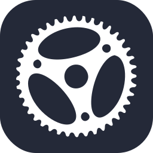</td>
        <td><code>adonis</code></td>
        <td></td>
        <td><code>aftereffects</code></td>
        <td></td>
    </tr>
    <tr>
        <td><code>aiscript</code></td>
        <td></td>
        <td><code>alpinejs</code></td>
        <td>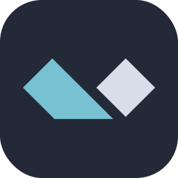</td>
        <td><code>androidstudio</code></td>
        <td></td>
    </tr>
    <tr>
        <td><code>angular</code></td>
        <td>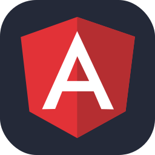</td>
        <td><code>ansible</code></td>
        <td>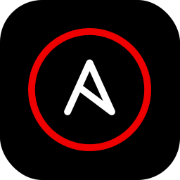</td>
        <td><code>apollo</code></td>
        <td></td>
    </tr>
    <tr>
        <td><code>appwrite</code></td>
        <td>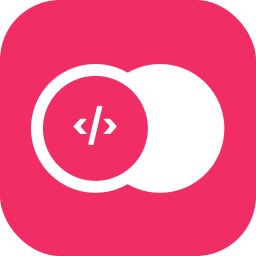</td>
        <td><code>arduino</code></td>
        <td>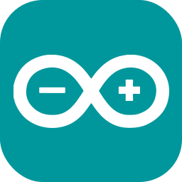</td>
        <td><code>astro</code></td>
        <td>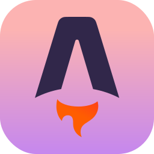</td>
    </tr>
    <tr>
        <td><code>atom</code></td>
        <td></td>
        <td><code>audition</code></td>
        <td></td>
        <td><code>autocad</code></td>
        <td></td>
    </tr>
    <tr>
        <td><code>azul</code></td>
        <td></td>
        <td><code>azure</code></td>
        <td>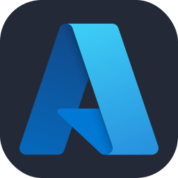</td>
        <td><code>bsd</code></td>
        <td></td>
    </tr>
    <tr>
        <td><code>babel</code></td>
        <td></td>
        <td><code>bash</code></td>
        <td>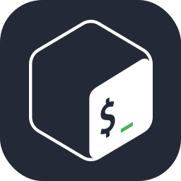</td>
        <td><code>bevy</code></td>
        <td></td>
    </tr>
    <tr>
        <td><code>blender</code></td>
        <td></td>
        <td><code>bootstrap</code></td>
        <td></td>
        <td><code>c</code></td>
        <td></td>
    </tr>
    <tr>
        <td><code>cmake</code></td>
        <td>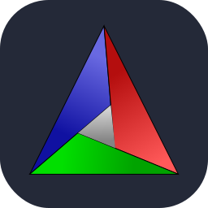</td>
        <td><code>cpp</code></td>
        <td>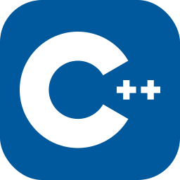</td>
        <td><code>cs</code></td>
        <td></td>
    </tr>
    <tr>
        <td><code>css</code></td>
        <td></td>
        <td><code>cassandra</code></td>
        <td></td>
        <td><code>clojure</code></td>
        <td>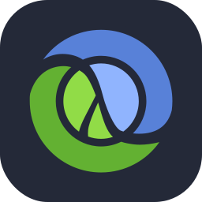</td>
    </tr>
    <tr>
        <td><code>cloudflare</code></td>
        <td></td>
        <td><code>codepen</code></td>
        <td></td>
        <td><code>coffeescript</code></td>
        <td></td>
    </tr>
    <tr>
        <td><code>crystal</code></td>
        <td>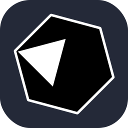</td>
        <td><code>d3</code></td>
        <td></td>
        <td><code>deno</code></td>
        <td></td>
    </tr>
    <tr>
        <td><code>dart</code></td>
        <td>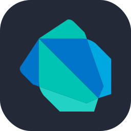</td>
        <td><code>devto</code></td>
        <td></td>
        <td><code>discord</code></td>
        <td></td>
    </tr>
    <tr>
        <td><code>discordbots</code></td>
        <td></td>
        <td><code>django</code></td>
        <td></td>
        <td><code>docker</code></td>
        <td>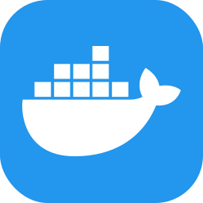</td>
    </tr>
    <tr>
        <td><code>dotnet</code></td>
        <td></td>
        <td><code>dynamodb</code></td>
        <td>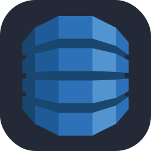</td>
        <td><code>eclipse</code></td>
        <td>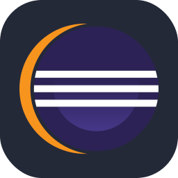</td>
    </tr>
    <tr>
        <td><code>elasticsearch</code></td>
        <td></td>
        <td><code>electron</code></td>
        <td></td>
        <td><code>elixir</code></td>
        <td>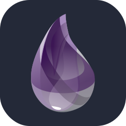</td>
    </tr>
    <tr>
        <td><code>emacs</code></td>
        <td></td>
        <td><code>ember</code></td>
        <td></td>
        <td><code>emotion</code></td>
        <td>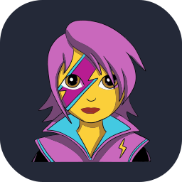</td>
    </tr>
    <tr>
        <td><code>expressjs</code></td>
        <td></td>
        <td><code>fastapi</code></td>
        <td>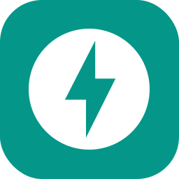</td>
        <td><code>fediverse</code></td>
        <td>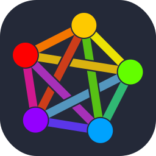</td>
    </tr>
    <tr>
        <td><code>figma</code></td>
        <td>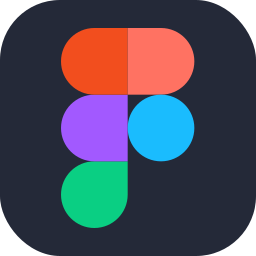</td>
        <td><code>firebase</code></td>
        <td></td>
        <td><code>flask</code></td>
        <td></td>
    </tr>
    <tr>
        <td><code>flutter</code></td>
        <td></td>
        <td><code>forth</code></td>
        <td></td>
        <td><code>fortran</code></td>
        <td></td>
    </tr>
    <tr>
        <td><code>gcp</code></td>
        <td></td>
        <td><code>gtk</code></td>
        <td>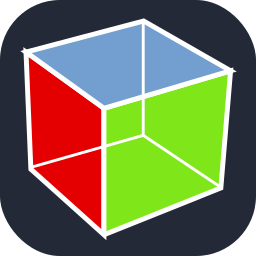</td>
        <td><code>gamemakerstudio</code></td>
        <td>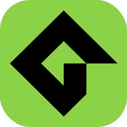</td>
    </tr>
    <tr>
        <td><code>gatsby</code></td>
        <td></td>
        <td><code>gherkin</code></td>
        <td></td>
        <td><code>git</code></td>
        <td>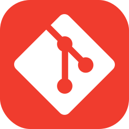</td>
    </tr>
    <tr>
        <td><code>gitlab</code></td>
        <td></td>
        <td><code>github</code></td>
        <td></td>
        <td><code>githubactions</code></td>
        <td></td>
    </tr>
    <tr>
        <td><code>golang</code></td>
        <td></td>
        <td><code>godot</code></td>
        <td>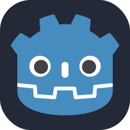</td>
        <td><code>gradle</code></td>
        <td></td>
    </tr>
    <tr>
        <td><code>grafana</code></td>
        <td></td>
        <td><code>graphql</code></td>
        <td>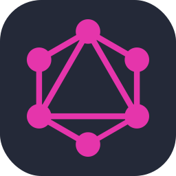</td>
        <td><code>gulp</code></td>
        <td></td>
    </tr>
    <tr>
        <td><code>html</code></td>
        <td></td>
        <td><code>haskell</code></td>
        <td>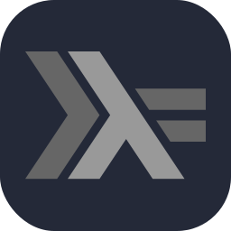</td>
        <td><code>haxe</code></td>
        <td></td>
    </tr>
    <tr>
        <td><code>haxeflixel</code></td>
        <td>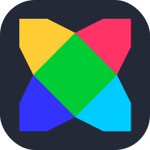</td>
        <td><code>heroku</code></td>
        <td></td>
        <td><code>hibernate</code></td>
        <td></td>
    </tr>
    <tr>
        <td><code>ipfs</code></td>
        <td>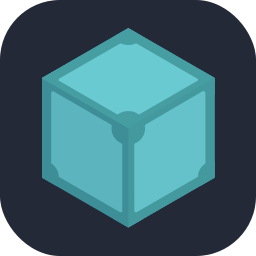</td>
        <td><code>idea</code></td>
        <td></td>
        <td><code>illustrator</code></td>
        <td></td>
    </tr>
    <tr>
        <td><code>instagram</code></td>
        <td></td>
        <td><code>jquery</code></td>
        <td></td>
        <td><code>java</code></td>
        <td></td>
    </tr>
    <tr>
        <td><code>javascript</code></td>
        <td></td>
        <td><code>jenkins</code></td>
        <td></td>
        <td><code>jest</code></td>
        <td></td>
    </tr>
    <tr>
        <td><code>julia</code></td>
        <td>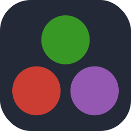</td>
        <td><code>kafka</code></td>
        <td>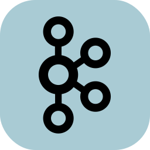</td>
        <td><code>kibana</code></td>
        <td>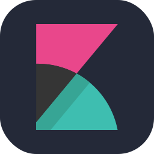</td>
    </tr>
    <tr>
        <td><code>kotlin</code></td>
        <td>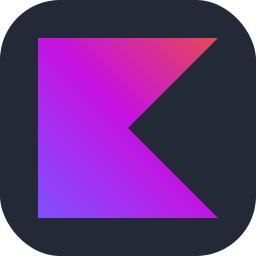</td>
        <td><code>ktor</code></td>
        <td>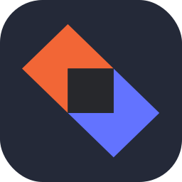</td>
        <td><code>kubernetes</code></td>
        <td></td>
    </tr>
    <tr>
        <td><code>latex</code></td>
        <td></td>
        <td><code>laravel</code></td>
        <td>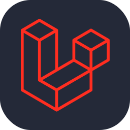</td>
        <td><code>linkedin</code></td>
        <td></td>
    </tr>
    <tr>
        <td><code>linux</code></td>
        <td></td>
        <td><code>lit</code></td>
        <td></td>
        <td><code>logstash</code></td>
        <td></td>
    </tr>
    <tr>
        <td><code>lua</code></td>
        <td></td>
        <td><code>msdos</code></td>
        <td></td>
        <td><code>markdown</code></td>
        <td></td>
    </tr>
    <tr>
        <td><code>mastodon</code></td>
        <td></td>
        <td><code>materialui</code></td>
        <td></td>
        <td><code>matlab</code></td>
        <td></td>
    </tr>
    <tr>
        <td><code>maven</code></td>
        <td></td>
        <td><code>misskey</code></td>
        <td></td>
        <td><code>mongodb</code></td>
        <td></td>
    </tr>
    <tr>
        <td><code>mysql</code></td>
        <td></td>
        <td><code>neovim</code></td>
        <td>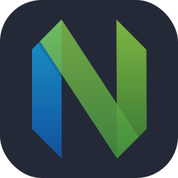</td>
        <td><code>nestjs</code></td>
        <td></td>
    </tr>
    <tr>
        <td><code>netlify</code></td>
        <td>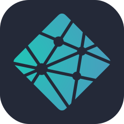</td>
        <td><code>nextjs</code></td>
        <td>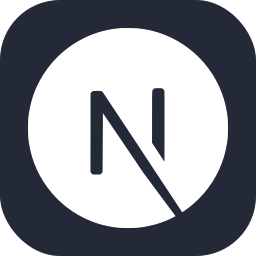</td>
        <td><code>nginx</code></td>
        <td></td>
    </tr>
    <tr>
        <td><code>nim</code></td>
        <td></td>
        <td><code>nodejs</code></td>
        <td></td>
        <td><code>nuxtjs</code></td>
        <td></td>
    </tr>
    <tr>
        <td><code>ocaml</code></td>
        <td></td>
        <td><code>octave</code></td>
        <td>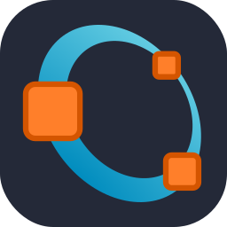</td>
        <td><code>openshift</code></td>
        <td>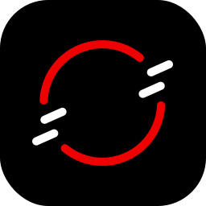</td>
    </tr>
    <tr>
        <td><code>openstack</code></td>
        <td>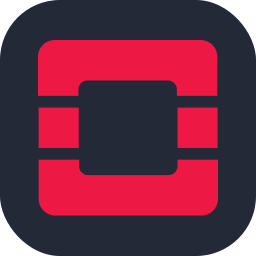</td>
        <td><code>php</code></td>
        <td></td>
        <td><code>perl</code></td>
        <td></td>
    </tr>
    <tr>
        <td><code>photoshop</code></td>
        <td></td>
        <td><code>plan9</code></td>
        <td></td>
        <td><code>planetscale</code></td>
        <td></td>
    </tr>
    <tr>
        <td><code>postgresql</code></td>
        <td></td>
        <td><code>postman</code></td>
        <td></td>
        <td><code>powershell</code></td>
        <td></td>
    </tr>
    <tr>
        <td><code>premiere</code></td>
        <td></td>
        <td><code>prisma</code></td>
        <td></td>
        <td><code>processing</code></td>
        <td></td>
    </tr>
    <tr>
        <td><code>prometheus</code></td>
        <td></td>
        <td><code>pug</code></td>
        <td></td>
        <td><code>pytorch</code></td>
        <td></td>
    </tr>
    <tr>
        <td><code>python</code></td>
        <td></td>
        <td><code>qt</code></td>
        <td></td>
        <td><code>r</code></td>
        <td></td>
    </tr>
    <tr>
        <td><code>ros</code></td>
        <td></td>
        <td><code>rabbitmq</code></td>
        <td>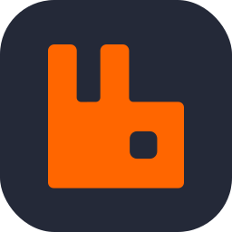</td>
        <td><code>rails</code></td>
        <td>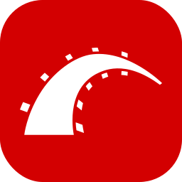</td>
    </tr>
    <tr>
        <td><code>raspberrypi</code></td>
        <td>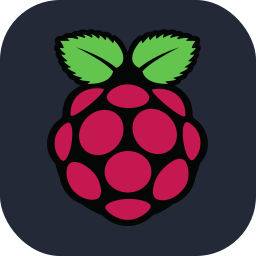</td>
        <td><code>react</code></td>
        <td></td>
        <td><code>reactivex</code></td>
        <td>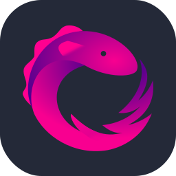</td>
    </tr>
    <tr>
        <td><code>redis</code></td>
        <td>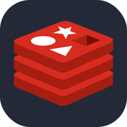</td>
        <td><code>redux</code></td>
        <td></td>
        <td><code>regex</code></td>
        <td>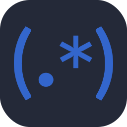</td>
    </tr>
    <tr>
        <td><code>remix</code></td>
        <td></td>
        <td><code>replit</code></td>
        <td></td>
        <td><code>rocket</code></td>
        <td></td>
    </tr>
    <tr>
        <td><code>rollupjs</code></td>
        <td></td>
        <td><code>ruby</code></td>
        <td>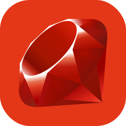</td>
        <td><code>rust</code></td>
        <td></td>
    </tr>
    <tr>
        <td><code>sqlite</code></td>
        <td></td>
        <td><code>svg</code></td>
        <td></td>
        <td><code>sass</code></td>
        <td></td>
    </tr>
    <tr>
        <td><code>scala</code></td>
        <td>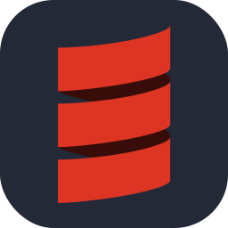</td>
        <td><code>selenium</code></td>
        <td></td>
        <td><code>sentry</code></td>
        <td></td>
    </tr>
    <tr>
        <td><code>sequelize</code></td>
        <td></td>
        <td><code>sketchup</code></td>
        <td></td>
        <td><code>solidjs</code></td>
        <td></td>
    </tr>
    <tr>
        <td><code>solidity</code></td>
        <td></td>
        <td><code>spring</code></td>
        <td></td>
        <td><code>stackoverflow</code></td>
        <td></td>
    </tr>
    <tr>
        <td><code>styledcomponents</code></td>
        <td></td>
        <td><code>supabase</code></td>
        <td></td>
        <td><code>svelte</code></td>
        <td></td>
    </tr>
    <tr>
        <td><code>swift</code></td>
        <td></td>
        <td><code>symfony</code></td>
        <td></td>
        <td><code>tailwindcss</code></td>
        <td></td>
    </tr>
    <tr>
        <td><code>tauri</code></td>
        <td></td>
        <td><code>tensorflow</code></td>
        <td></td>
        <td><code>threejs</code></td>
        <td></td>
    </tr>
    <tr>
        <td><code>twitter</code></td>
        <td></td>
        <td><code>typescript</code></td>
        <td></td>
        <td><code>unity</code></td>
        <td></td>
    </tr>
    <tr>
        <td><code>unrealengine</code></td>
        <td></td>
        <td><code>v</code></td>
        <td></td>
        <td><code>vim</code></td>
        <td></td>
    </tr>
    <tr>
        <td><code>vscode</code></td>
        <td></td>
        <td><code>vala</code></td>
        <td></td>
        <td><code>vercel</code></td>
        <td></td>
    </tr>
    <tr>
        <td><code>visualstudio</code></td>
        <td></td>
        <td><code>vite</code></td>
        <td></td>
        <td><code>vuejs</code></td>
        <td></td>
    </tr>
    <tr>
        <td><code>webassembly</code></td>
        <td></td>
        <td><code>webflow</code></td>
        <td></td>
        <td><code>webpack</code></td>
        <td></td>
    </tr>
    <tr>
        <td><code>windicss</code></td>
        <td></td>
        <td><code>wordpress</code></td>
        <td></td>
        <td><code>workers</code></td>
        <td></td>
    </tr>
    <tr>
        <td><code>xd</code></td>
        <td> </td><code><td>zig</code></td>
        <td></td>
    </tr>
</table>
