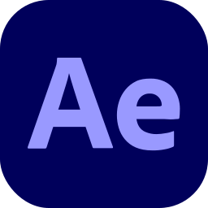

    <h1>IconsNew</h1>

Test icon with <a href="https://icons-theta.vercel.app/icons?i=es,lg,kb,&perline=1">https://icons-theta.vercel.app/icons?i=es,lg,kb,&perline=1</a>  

<table>
    <tr>
        <th>Name</th>
        <th>Icon</th>
        <th>Name</th>
        <th>Icon</th>
        <th>Name</th>
        <th>Icon</th>
    </tr>
    <tr>
        <td><code>AWS</code></td>
        <td></td>
        <td><code>Ableton</code></td>
        <td></td>
        <td><code>ActivityPub</code></td>
        <td></td>
    </tr>
    <tr>
        <td><code>Actix</code></td>
        <td></td>
        <td><code>Adonis</code></td>
        <td></td>
        <td><code>AfterEffects</code></td>
        <td></td>
    </tr>
    <tr>
        <td><code>AiScript</code></td>
        <td></td>
        <td><code>AlpineJS</code></td>
        <td></td>
        <td><code>AndroidStudio</code></td>
        <td></td>
    </tr>
    <tr>
        <td><code>Angular</code></td>
        <td></td>
        <td><code>Ansible</code></td>
        <td></td>
        <td><code>Apollo</code></td>
        <td></td>
    </tr>
    <tr>
        <td><code>Appwrite</code></td>
        <td></td>
        <td><code>Arduino</code></td>
        <td></td>
        <td><code>Astro</code></td>
        <td></td>
    </tr>
    <tr>
        <td><code>Atom</code></td>
        <td></td>
        <td><code>Audition</code></td>
        <td></td>
        <td><code>AutoCAD</code></td>
        <td></td>
    </tr>
    <tr>
        <td><code>Azul</code></td>
        <td></td>
        <td><code>Azure</code></td>
        <td></td>
        <td><code>BSD</code></td>
        <td></td>
    </tr>
    <tr>
        <td><code>Babel</code></td>
        <td></td>
        <td><code>Bash</code></td>
        <td></td>
        <td><code>Bevy</code></td>
        <td></td>
    </tr>
    <tr>
        <td><code>Blender</code></td>
        <td></td>
        <td><code>Bootstrap</code></td>
        <td></td>
        <td><code>C</code></td>
        <td></td>
    </tr>
    <tr>
        <td><code>CMake</code></td>
        <td></td>
        <td><code>CPP</code></td>
        <td></td>
        <td><code>CS</code></td>
        <td></td>
    </tr>
    <tr>
        <td><code>CSS</code></td>
        <td></td>
        <td><code>Cassandra</code></td>
        <td></td>
        <td><code>Clojure</code></td>
        <td></td>
    </tr>
    <tr>
        <td><code>Cloudflare</code></td>
        <td></td>
        <td><code>CodePen</code></td>
        <td></td>
        <td><code>CoffeeScript</code></td>
        <td></td>
    </tr>
    <tr>
        <td><code>Crystal</code></td>
        <td></td>
        <td><code>D3</code></td>
        <td></td>
        <td><code>DENO</code></td>
        <td></td>
    </tr>
    <tr>
        <td><code>Dart</code></td>
        <td></td>
        <td><code>DevTo</code></td>
        <td></td>
        <td><code>Discord</code></td>
        <td></td>
    </tr>
    <tr>
        <td><code>DiscordBots</code></td>
        <td></td>
        <td><code>Django</code></td>
        <td></td>
        <td><code>Docker</code></td>
        <td></td>
    </tr>
    <tr>
        <td><code>DotNet</code></td>
        <td></td>
        <td><code>DynamoDB</code></td>
        <td></td>
        <td><code>Eclipse</code></td>
        <td></td>
    </tr>
    <tr>
        <td><code>Elasticsearch</code></td>
        <td></td>
        <td><code>Electron</code></td>
        <td></td>
        <td><code>Elixir</code></td>
        <td></td>
    </tr>
    <tr>
        <td><code>Emacs</code></td>
        <td></td>
        <td><code>Ember</code></td>
        <td></td>
        <td><code>Emotion</code></td>
        <td></td>
    </tr>
    <tr>
        <td><code>ExpressJS</code></td>
        <td></td>
        <td><code>FastAPI</code></td>
        <td></td>
        <td><code>Fediverse</code></td>
        <td></td>
    </tr>
    <tr>
        <td><code>Figma</code></td>
        <td></td>
        <td><code>Firebase</code></td>
        <td></td>
        <td><code>Flask</code></td>
        <td></td>
    </tr>
    <tr>
        <td><code>Flutter</code></td>
        <td></td>
        <td><code>Forth</code></td>
        <td></td>
        <td><code>Fortran</code></td>
        <td></td>
    </tr>
    <tr>
        <td><code>GCP</code></td>
        <td></td>
        <td><code>GTK</code></td>
        <td></td>
        <td><code>GameMakerStudio</code></td>
        <td></td>
    </tr>
    <tr>
        <td><code>Gatsby</code></td>
        <td></td>
        <td><code>Gherkin</code></td>
        <td></td>
        <td><code>Git</code></td>
        <td></td>
    </tr>
    <tr>
        <td><code>GitLab</code></td>
        <td></td>
        <td><code>Github</code></td>
        <td></td>
        <td><code>GithubActions</code></td>
        <td></td>
    </tr>
    <tr>
        <td><code>GoLang</code></td>
        <td></td>
        <td><code>Godot</code></td>
        <td></td>
        <td><code>Gradle</code></td>
        <td></td>
    </tr>
    <tr>
        <td><code>Grafana</code></td>
        <td></td>
        <td><code>GraphQL</code></td>
        <td></td>
        <td><code>Gulp</code></td>
        <td></td>
    </tr>
    <tr>
        <td><code>HTML</code></td>
        <td></td>
        <td><code>Haskell</code></td>
        <td></td>
        <td><code>Haxe</code></td>
        <td></td>
    </tr>
    <tr>
        <td><code>HaxeFlixel</code></td>
        <td></td>
        <td><code>Heroku</code></td>
        <td></td>
        <td><code>Hibernate</code></td>
        <td></td>
    </tr>
    <tr>
        <td><code>IPFS</code></td>
        <td></td>
        <td><code>Idea</code></td>
        <td></td>
        <td><code>Illustrator</code></td>
        <td></td>
    </tr>
    <tr>
        <td><code>Instagram</code></td>
        <td></td>
        <td><code>JQuery</code></td>
        <td></td>
        <td><code>Java</code></td>
        <td></td>
    </tr>
    <tr>
        <td><code>JavaScript</code></td>
        <td></td>
        <td><code>Jenkins</code></td>
        <td></td>
        <td><code>Jest</code></td>
        <td></td>
    </tr>
    <tr>
        <td><code>Julia</code></td>
        <td></td>
        <td><code>Kafka</code></td>
        <td></td>
        <td><code>Kibana</code></td>
        <td></td>
    </tr>
    <tr>
        <td><code>Kotlin</code></td>
        <td></td>
        <td><code>Ktor</code></td>
        <td></td>
        <td><code>Kubernetes</code></td>
        <td></td>
    </tr>
    <tr>
        <td><code>LaTeX</code></td>
        <td></td>
        <td><code>Laravel</code></td>
        <td></td>
        <td><code>LinkedIn</code></td>
        <td></td>
    </tr>
    <tr>
        <td><code>Linux</code></td>
        <td></td>
        <td><code>Lit</code></td>
        <td></td>
        <td><code>Logstash</code></td>
        <td></td>
    </tr>
    <tr>
        <td><code>Lua</code></td>
        <td></td>
        <td><code>MSDOS</code></td>
        <td></td>
        <td><code>Markdown</code></td>
        <td></td>
    </tr>
    <tr>
        <td><code>Mastodon</code></td>
        <td></td>
        <td><code>MaterialUI</code></td>
        <td></td>
        <td><code>Matlab</code></td>
        <td></td>
    </tr>
    <tr>
        <td><code>Maven</code></td>
        <td></td>
        <td><code>Misskey</code></td>
        <td></td>
        <td><code>MongoDB</code></td>
        <td></td>
    </tr>
    <tr>
        <td><code>MySQL</code></td>
        <td></td>
        <td><code>NeoVim</code></td>
        <td></td>
        <td><code>NestJS</code></td>
        <td></td>
    </tr>
    <tr>
        <td><code>Netlify</code></td>
        <td></td>
        <td><code>NextJS</code></td>
        <td></td>
        <td><code>Nginx</code></td>
        <td></td>
    </tr>
    <tr>
        <td><code>Nim</code></td>
        <td></td>
        <td><code>NodeJS</code></td>
        <td></td>
        <td><code>NuxtJS</code></td>
        <td></td>
    </tr>
    <tr>
        <td><code>OCaml</code></td>
        <td></td>
        <td><code>Octave</code></td>
        <td></td>
        <td><code>OpenShift</code></td>
        <td></td>
    </tr>
    <tr>
        <td><code>OpenStack</code></td>
        <td></td>
        <td><code>PHP</code></td>
        <td></td>
        <td><code>Perl</code></td>
        <td></td>
    </tr>
    <tr>
        <td><code>Photoshop</code></td>
        <td></td>
        <td><code>Plan9</code></td>
        <td></td>
        <td><code>PlanetScale</code></td>
        <td></td>
    </tr>
    <tr>
        <td><code>PostgreSQL</code></td>
        <td></td>
        <td><code>Postman</code></td>
        <td></td>
        <td><code>Powershell</code></td>
        <td></td>
    </tr>
    <tr>
        <td><code>Premiere</code></td>
        <td></td>
        <td><code>Prisma</code></td>
        <td></td>
        <td><code>Processing</code></td>
        <td></td>
    </tr>
    <tr>
        <td><code>Prometheus</code></td>
        <td></td>
        <td><code>Pug</code></td>
        <td></td>
        <td><code>PyTorch</code></td>
        <td></td>
    </tr>
    <tr>
        <td><code>Python</code></td>
        <td></td>
        <td><code>QT</code></td>
        <td></td>
        <td><code>R</code></td>
        <td></td>
    </tr>
    <tr>
        <td><code>ROS</code></td>
        <td></td>
        <td><code>RabbitMQ</code></td>
        <td></td>
        <td><code>Rails</code></td>
        <td></td>
    </tr>
    <tr>
        <td><code>RaspberryPi</code></td>
        <td></td>
        <td><code>React</code></td>
        <td></td>
        <td><code>ReactiveX</code></td>
        <td></td>
    </tr>
    <tr>
        <td><code>Redis</code></td>
        <td></td>
        <td><code>Redux</code></td>
        <td></td>
        <td><code>Regex</code></td>
        <td></td>
    </tr>
    <tr>
        <td><code>Remix</code></td>
        <td></td>
        <td><code>Replit</code></td>
        <td></td>
        <td><code>Rocket</code></td>
        <td></td>
    </tr>
    <tr>
        <td><code>RollupJS</code></td>
        <td></td>
        <td><code>Ruby</code></td>
        <td></td>
        <td><code>Rust</code></td>
        <td></td>
    </tr>
    <tr>
        <td><code>SQLite</code></td>
        <td></td>
        <td><code>SVG</code></td>
        <td></td>
        <td><code>Sass</code></td>
        <td></td>
    </tr>
    <tr>
        <td><code>Scala</code></td>
        <td></td>
        <td><code>Selenium</code></td>
        <td></td>
        <td><code>Sentry</code></td>
        <td></td>
    </tr>
    <tr>
        <td><code>Sequelize</code></td>
        <td></td>
        <td><code>Sketchup</code></td>
        <td></td>
        <td><code>SolidJS</code></td>
        <td></td>
    </tr>
    <tr>
        <td><code>Solidity</code></td>
        <td></td>
        <td><code>Spring</code></td>
        <td></td>
        <td><code>StackOverflow</code></td>
        <td></td>
    </tr>
    <tr>
        <td><code>StyledComponents</code></td>
        <td></td>
        <td><code>Supabase</code></td>
        <td></td>
        <td><code>Svelte</code></td>
        <td></td>
    </tr>
    <tr>
        <td><code>Swift</code></td>
        <td></td>
        <td><code>Symfony</code></td>
        <td></td>
        <td><code>TailwindCSS</code></td>
        <td></td>
    </tr>
    <tr>
        <td><code>Tauri</code></td>
        <td></td>
        <td><code>TensorFlow</code></td>
        <td></td>
        <td><code>ThreeJS</code></td>
        <td></td>
    </tr>
    <tr>
        <td><code>Twitter</code></td>
        <td></td>
        <td><code>TypeScript</code></td>
        <td></td>
        <td><code>Unity</code></td>
        <td></td>
    </tr>
    <tr>
        <td><code>UnrealEngine</code></td>
        <td></td>
        <td><code>V</code></td>
        <td></td>
        <td><code>VIM</code></td>
        <td></td>
    </tr>
    <tr>
        <td><code>VSCode</code></td>
        <td></td>
        <td><code>Vala</code></td>
        <td></td>
        <td><code>Vercel</code></td>
        <td></td>
    </tr>
    <tr>
        <td><code>VisualStudio</code></td>
        <td></td>
        <td><code>Vite</code></td>
        <td></td>
        <td><code>VueJS</code></td>
        <td></td>
    </tr>
    <tr>
        <td><code>WebAssembly</code></td>
        <td></td>
        <td><code>Webflow</code></td>
        <td></td>
        <td><code>Webpack</code></td>
        <td></td>
    </tr>
    <tr>
        <td><code>WindiCSS</code></td>
        <td></td>
        <td><code>Wordpress</code></td>
        <td></td>
        <td><code>Workers</code></td>
        <td></td>
    </tr>
    <tr>
        <td><code>XD</code></td>
        <td> </td><code><td>Zig</code></td>
        <td></td>
    </tr>
</table>
